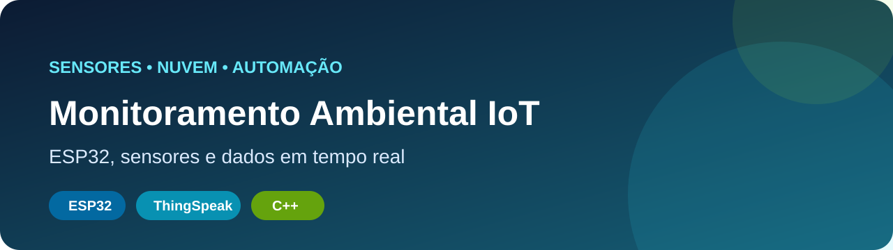
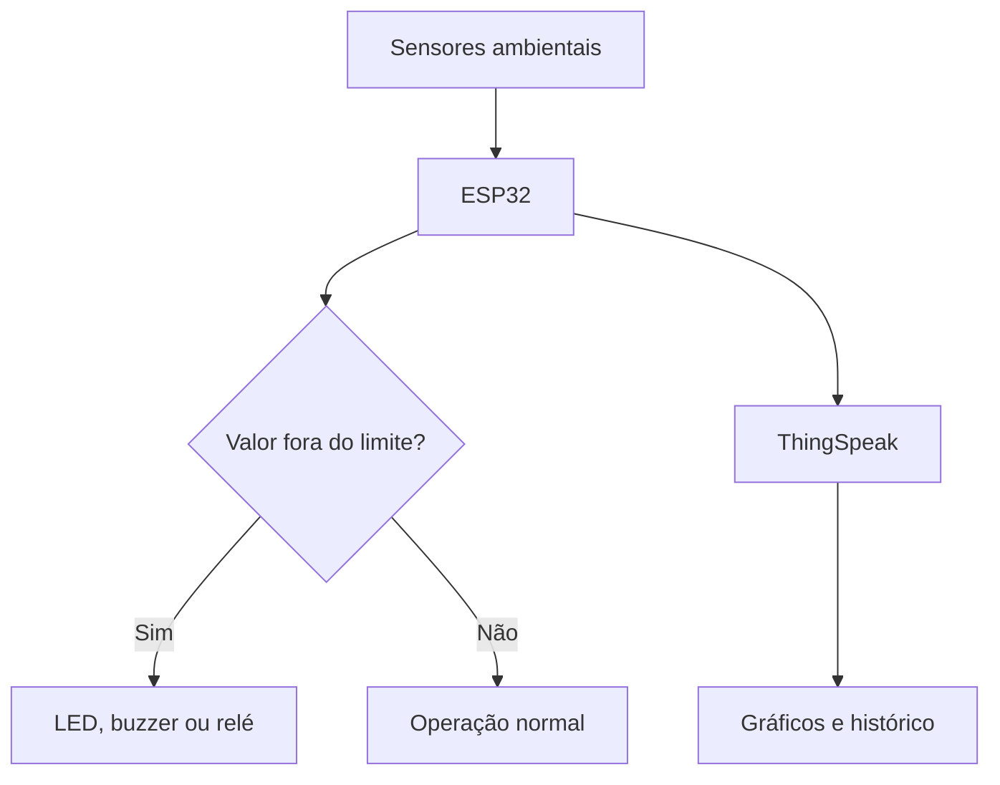
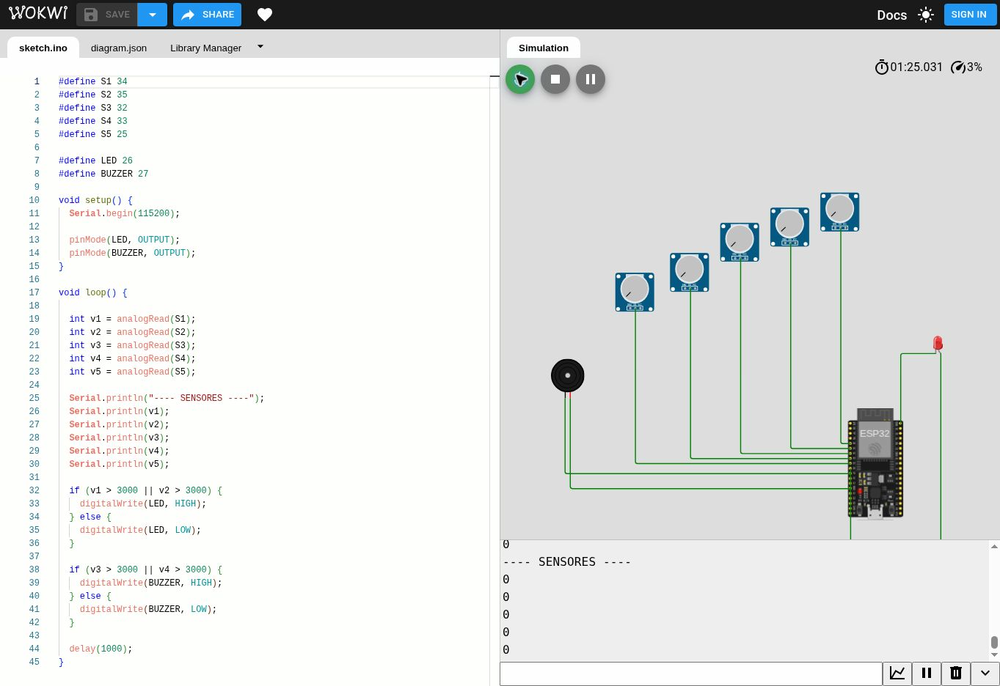
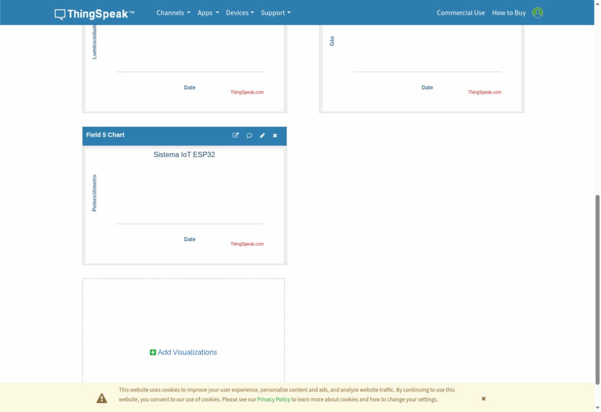

<p align="center"></p>

# Sistema IoT de Monitoramento Ambiental com ESP32

Sistema que coleta variáveis ambientais, identifica condições fora dos limites, aciona alertas locais e envia os dados ao ThingSpeak para acompanhamento remoto.

## Problema

Ambientes agrícolas, residenciais e industriais precisam acompanhar temperatura, umidade, luminosidade, qualidade do ar e condição do solo. Sem automação, mudanças importantes podem ser percebidas tarde demais.

## Solução

O ESP32 centraliza as leituras, aplica regras de decisão e conecta sensores, atuadores e nuvem em um único fluxo.



## Demonstração real

### Simulação no Wokwi

[](https://wokwi.com/projects/466138169004087297)

*Circuito real do projeto em execução no Wokwi, com ESP32, cinco entradas analógicas, LED, buzzer e monitor serial.*

[Abrir a simulação no Wokwi](https://wokwi.com/projects/466138169004087297)

### Canal no ThingSpeak

[](https://thingspeak.mathworks.com/channels/3402588)

*Canal real configurado com cinco campos para visualização. A captura registra a simulação inicial do projeto, realizada antes do envio das medições demonstrativas.*

[Abrir o canal público no ThingSpeak](https://thingspeak.mathworks.com/channels/3402588)

## Variáveis e respostas

| Elemento | Função |
|---|---|
| DHT22 | Temperatura e umidade |
| Sensor de luminosidade | Nível de luz |
| Sensor de solo | Umidade do solo |
| Sensor de ar | Indicador de qualidade do ar |
| Potenciômetro | Simulação analógica |
| LED e buzzer | Alertas locais |
| Relé | Acionamento de carga |
| ThingSpeak | Histórico e visualização |

## Diferenciais

- múltiplas variáveis ambientais;
- integração entre hardware, software e nuvem;
- alertas e acionamento automático;
- simulação no Wokwi;
- firmware compilado automaticamente no GitHub Actions;
- proteção para chaves do ThingSpeak.

## Indicadores para um piloto

| Indicador | Decisão apoiada |
|---|---|
| Taxa de envio bem-sucedido | Medir confiabilidade |
| Leituras fora dos limites | Identificar riscos |
| Disponibilidade do dispositivo | Medir continuidade |
| Intervalo entre leituras | Verificar regularidade |
| Tempo entre evento e alerta | Avaliar resposta |

> Os indicadores estão definidos, mas o portfólio não apresenta números sem coleta real.

## Como executar

1. Instale o VS Code e a extensão PlatformIO.
2. Abra o projeto.
3. Configure uma chave de escrita do ThingSpeak apenas no ambiente local.
4. Compile, envie o firmware e abra o monitor serial.

```bash
pio run
pio run --target upload
pio device monitor
```

Nunca substitua o placeholder por uma chave real antes de publicar o código.

## Estrutura

```text
├── src/main.cpp          # firmware do ESP32
├── platformio.ini        # placa e dependências
├── assets/cover.svg      # capa do projeto
├── assets/*-*.svg        # evidências visuais reais
├── .github/workflows/    # compilação automática
└── README.md
```

## Aplicações possíveis

- agricultura inteligente;
- casas e escolas;
- laboratórios;
- ambientes industriais;
- monitoramento ambiental;
- automação residencial.

## Segurança e qualidade

- a chave presente no código é apenas um placeholder;
- segredos e credenciais locais não devem ser versionados;
- o GitHub Actions compila o firmware em PRs e atualizações da `main`.

## Próximos passos

- registrar as primeiras medições reais no ThingSpeak;
- coletar indicadores em um teste controlado;
- enviar alertas por e-mail ou aplicativo;
- integrar um dashboard analítico;
- testar sensores físicos e gabinete impresso em 3D.

## Autor

**Sandro Ferreira** — estudante de Engenharia da Computação e de Inteligência Artificial e Automação Digital.

[LinkedIn](https://linkedin.com/in/sandrozdb) · [GitHub](https://github.com/sandrozdb)
